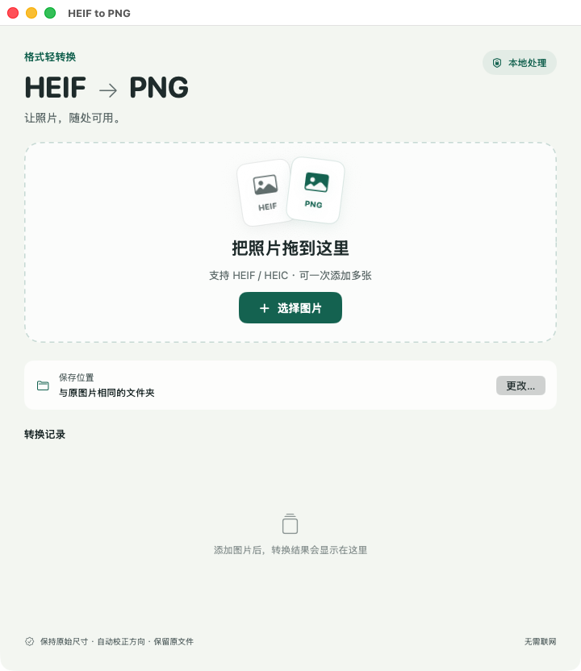

# HEIF to PNG

一个轻量的 macOS 图片转换工具。拖入 HEIF / HEIC 照片，批量转换为 PNG，全程本地处理，无需联网。

A small native macOS app that batch-converts HEIF / HEIC photos to PNG. All image processing happens locally, using Apple's Image I/O framework. No third-party dependencies.

## 界面预览



## 功能

- 拖拽添加图片，或通过文件选择器批量添加。
- 保留主图完整像素尺寸，自动处理旋转和镜像方向。
- 默认保存到原图所在文件夹，也可选择统一的输出位置。
- 保留原文件；遇到同名 PNG 时自动编号，不覆盖已有文件。
- 单张失败不影响后续转换，支持在 Finder 中查看结果。

## 运行环境

- Apple 芯片 Mac（arm64），macOS 13 或更高版本。
- 从源码构建需要 Apple Command Line Tools 或 Xcode。

## 构建与使用

```sh
git clone https://github.com/314857493/heif-to-png.git
cd heif-to-png
bash Source/build.sh
open "HEIF to PNG.app"
```

也可以在 Finder 中双击生成的 `HEIF to PNG.app`。如需安装到应用程序目录，手动拖入即可。

打开后拖入图片，或点击「选择图片」，应用会自动开始转换。默认在每张原图旁边生成 PNG。若要统一保存位置，先点击「更改…」，再添加图片。

构建产物使用本地临时签名，未经过 Apple 开发者公证。

## 转换范围

每个文件导出一张主图。不会导出 HEIF 容器中的其他图像、深度数据、HDR 增益图或 Live Photo 视频。PNG 不复制 EXIF / GPS 拍摄信息，文件体积可能大于原始 HEIF。

## 测试

在正常的 macOS 终端中运行：

```sh
bash Tests/run.sh
```

测试会在临时目录生成真实 HEIC 图片，检查 8 种方向的输出尺寸、旋转后的像素、PNG 格式、原文件保护、重名编号、默认保存位置、损坏文件及伪装扩展名的输入。测试结束后清理临时文件。

HEIC 编码依赖 macOS 图像服务，需要在能访问这些服务的主机环境中执行测试。

## 项目结构

```text
Source/Converter.swift  Image I/O 转换逻辑
Source/UI.swift         SwiftUI 界面与任务队列
Source/main.swift       AppKit 应用入口
Source/Info.plist       应用信息与文件类型声明
Source/build.sh         构建与本地签名
Tests/main.swift        转换测试与样本生成
Tests/run.sh            测试入口
```

欢迎通过 Issue 或 Pull Request 提交问题和改进。涉及转换逻辑的修改，请运行上述测试，并提供问题图片的格式、尺寸及 macOS 版本；只有在愿意公开图片内容时才上传样本。

## License

[MIT](LICENSE)
